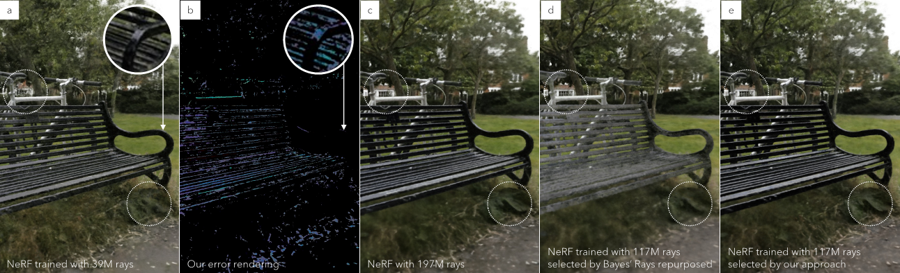

# NEF: Neural Error Fields for Follow-up Training with Fewer Rays

[](https://mediated-reality.github.io/projects/kitaura_vrst25/luchetti_visapp2026/)



## Overview

The pipeline to generate NEF:

1. Train your NeRF model
2. Take difference images between the rendering and the input images
3. Train (by means of fine-tuning) your NeRF with the difference images

All runs on [nerfstudio v0.3.4](https://github.com/nerfstudio-project/nerfstudio/tree/v0.3.4) and python.

> Tip: We chose `v0.3.4`, which is the latest minor version before v.1.0.0, simply because it was the latest when Dr. Alessandro Luchetti (University of Trento) started this project.

## Installing Libraries

Installing Nerfstudio (v0.3.4):

```
conda create --name nef -y python=3.8
conda activate nef
pip install --upgrade pip

pip install torch==2.1.2+cu118 torchvision==0.16.2+cu118 --extra-index-url https://download.pytorch.org/whl/cu118
conda install -c "nvidia/label/cuda-11.8.0" cuda-toolkit
pip install ninja git+https://github.com/NVlabs/tiny-cuda-nn/#subdirectory=bindings/torch

pip install nerfstudio==0.3.4
```

## NEF Training and Rendering

(optional) download the first nerfstudio training dataset example:
```sh
ns-download-data nerfstudio --capture-name=poster
```

### (1/3) Train Your NeRF Model

```sh
$nerfAlg = "nerfacto"
$downscaleFactor = 4

ns-train $nerfAlg --data ./data/nerfstudio/poster/ --max-num-iterations 3000 --viewer.quit-on-train-completion True nerfstudio-data --train-split-fraction 1.0 --downscale-factor $downscaleFactor

$latestNeRFDir = (Get-ChildItem -Path "./outputs/poster/$nerfAlg/" -Directory | Sort-Object LastWriteTime -Descending | Select-Object -First 1).Name
```

- `ns-train`: perform training
- `$nerfAlg`: perform NeRF algorithm (e.g., nerfacto)
    - `--data ./data/nerfstudio/poster/`: path to the input data
        - The directory must includes `images` and `transforms.json`
    - `--max-num-iterations 3000`: the maximum number of iterations
- `nerfstudio-data`: nerfstudio data specifics
    - `--train-split-fraction 1.0`: assume nerfstudio-data and the train/eval split is 1.0
    - `--downscale-factor $downscaleFactor`: (optional) downscale the input images. if used, be consistent

since the camera poses are re-centered, `transforms.json` needs to be re-created.

> Tips: This process re-order the image file names in ascendent order.

```sh
ns-export cameras --load-config ./outputs/poster/$nerfAlg/$latestNeRFDir/config.yml --output-dir data/nerfstudio/poster_diff
```

generate a new `camera_path.json` for rendering views:

```sh
python -m tools.create_camera_path ./data/nerfstudio/poster/transforms.json ./data/nerfstudio/poster_diff/transforms_train.json --output-dir ./data/nerfstudio/poster_diff/ --output-filename camera_path.json
```

render the views:

```sh
ns-render camera-path --load-config ./outputs/poster/$nerfAlg/$latestNeRFDir/config.yml --camera-path-filename ./data/nerfstudio/poster_diff/camera_path.json --output-format images --output-path ./data/nerfstudio/poster_diff/color_renderings --image-format png --downscale-factor $downscaleFactor
```

### (2/3) Create Difference Images

This generates `images` directory next to it:

```sh
python -m tools.create_diff_images ./data/nerfstudio/poster/ ./data/nerfstudio/poster_diff/color_renderings --downscale-factor $downscaleFactor
```

### (3/3) NEF Training:

```sh
ns-train $nerfAlg --data ./data/nerfstudio/poster_diff/ --load-dir ./outputs/poster/$nerfAlg/$latestNeRFDir/nerfstudio_models --max-num-iterations 1500 --viewer.quit-on-train-completion True nerfstudio-data --train-split-fraction 1.0 --downscale-factor $downscaleFactor

$latestNEFDir = (Get-ChildItem -Path "./outputs/poster_diff/$nerfAlg/" -Directory | Sort-Object LastWriteTime -Descending | Select-Object -First 1).Name
```

Render the reconstructed images at the input viewpoints to examine statistical differences between the rendered and actual images, for better post-proc.

```sh
ns-render camera-path --load-config ./outputs/poster_diff/$nerfAlg/$latestNEFDir/config.yml --camera-path-filename ./data/nerfstudio/poster_diff/camera_path.json --output-format images --output-path ./data/nerfstudio/poster_diff/diff_renderings --image-format png --downscale-factor $downscaleFactor
```

calculate stats values for post-processing

```sh
python -m tools.calc_stats_for_postproc ./data/nerfstudio/poster_diff/diff_renderings
```

Generate a camera path for final NEF renderings:

Go into nerfstudio and add keyframes.

> Tips: Need to add at least **two** keyframes. Set `duration: 2` and `fps: 1` then it adds exactly **two** keyframes only (no interpolation).

```sh
ns-viewer --load-config ./outputs/poster_diff/$nerfAlg/$latestNEFDir/config.yml
```

Let's assume we have `./camera_path_render.json`. Render the reconstructed images

```sh
ns-render camera-path --load-config ./outputs/poster_diff/$nerfAlg/$latestNEFDir/config.yml --camera-path-filename ./camera_path_render.json --output-format images --output-path ./outputs/test --image-format png --downscale-factor $downscaleFactor
```

Generate final final images:
```sh
python -m tools.postproc .\data\nerfstudio\poster_diff\diff_renderings_stats.npy .\outputs\test\ --masking-thresh 15
```

## Citation
```bib
@inproceedings{luchetti2026nef,
    title={NEF: Neural Error Fields for Follow-up Training with Fewer Rays},
    author={Luchetti, Alessandro and Ito, Kenta and Schmalstieg, Dieter and Kalkofen, Denis and Mori, Shohei},
    booktitle={Int. Conf. on Computer Vision Theory and Applications (VISAPP)},
    year={2026}
}
```